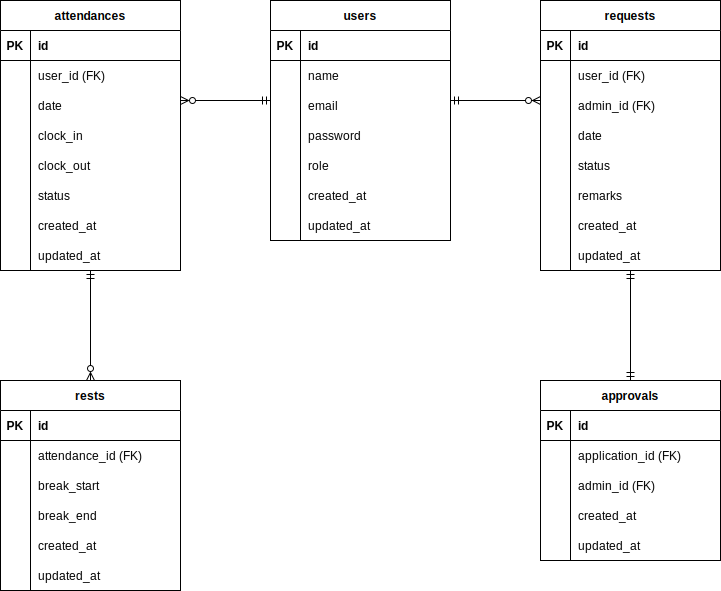

# 勤怠管理アプリ

## 実行環境
- Laravel Framework : 8.83.8
- MySQL Database : 8.0.26
- Nginx Server : 1.21.1
- PHP : 7.4.9-fpm
- MySQL 管理ツール : phpMyadmin

## URL
- 開発環境：http://localhost/
- phpMyAdmin:：http://localhost:8080/

## 環境構築

### 1. Docker ビルド
- [git clone リンク](https://github.com/dq-myk/attendance-test)
1. DockerDesktop アプリを起動後に以下を実行
```docker
docker-compose up -d --build
```
2. 以下のコマンドでメール認証用MailHogコンテナを起動  
```docker
docker run -d -p 1025:1025 -p 8025:8025 mailhog/mailhog
```
**メール認証用、mailhogアクセス先 : http://localhost:8025/**  
**※メールが届かない場合は、再送信をお願いします。**

### 2. Laravel の設定
- 以下を実行しPHPコンテナ内にログイン
```docker
docker-compose exec php bash
```
1. Laravelのパッケージをインストール  
```bash
composer install
```
2. 「.env.example」ファイルを複製後 「.env」へ名前を変更  
```bash
cp .env.example .env
```
3. アプリケーションキーの生成  
```bash
php artisan key:generate
```
4. マイグレーション実行
```bash
php artisan migrate
```

- ファクトリへの設定内容  
    users テーブルにダミーデータを 10 件、  
    （ダミー用のパスワードは全てpasswordを設定）  
    attendances テーブルにダミーデータを 20 件作成、  
    resets テーブルにダミーデータを作成

- シーダーファイルへの設定内容  
   確認時に使用する管理者を、users テーブルへ個別で 1件作成、  
   - name : 管理者
   - email : admin@example.com
   - password : password

5. シーディングの実行
```bash
php artisan db:seed
```

### テストアカウント
      name: 管理者(管理者用ログインに使用)  
      email: admin@example.com  
      password: password  
      -------------------------
      name: スタッフ(スタッフ用会員登録、ログイン、メール認証に使用)  
      email: staff@example.com  
      password: password  
      -------------------------

**※ログイン時にLaravelログ権限エラーが出た場合は以下の実行をお願いいたします。**  
- 以下を実行しPHPコンテナ内にログイン
```docker
docker-compose exec php bash
```
```bash
cd ../
```
```bash
chmod -R 777 www/.*
```
```bash
cd www
```

### 3. PHPUnitテスト
- 以下を実行しPHPコンテナ内にログイン
```docker
docker-compose exec php bash
```
1. テスト用マイグレーション実行
``` bash
php artisan migrate --env=testing
```
2. テスト実行
``` bash
php artisan test
```


**※本番環境と同一のデータベースを使用してテスト用テーブルを作成する為、**  
　**テスト用マイグレーションを実行すると、本番環境のデータが全て消えてしまいます。**  
　**テストケース検証後に本番環境の再確認が必要な場合は、お手数ですが再度以下の実行を**  
　**お願いいたします。**
- 以下を実行しPHPコンテナ内にログイン
```docker
docker-compose exec php bash
```
- マイグレーション実行
```bash
php artisan migrate
```
- シーディングの実行
```bash
php artisan db:seed
```

### 4. ER 図の作成

